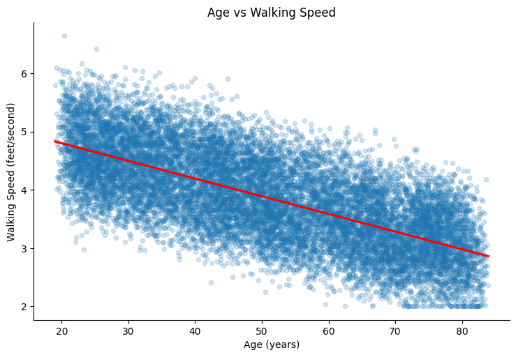

## Layout of Final Exam 

In order to better organize the repository, I've made three seperate folders called "plots", "code", and "csv". The "plots" folder contains all the figures that I will be referencing below. The "code" folder contains all commented code written to solve the exam. The "csv" contains all the CSV files generated from code. 

## Question 1 

For this question, I first ran the shell script to produce the ms_data_dirty.csv so I could determine which columns corresponded with the columns required in the final ms_data.csv file. The columns needed from ms_data_dirty.csv are 1 (patient_id), 2 (visit_id), 4 (age), 5 (education_level), 6 (walking_speed). There are a total of 15349 rows in the dataset. After running the shell script, I ensured that the ms_data.csv file did not contain any empty spaces, comments, or extra commas by skimming through the file. I was running into difficulty saving the CSV file with the appropriate column names as in my initial tries I got a CSV file that had unlabeled data. After some trial and error, I extracted the first row, which are the headers, and appended the rest of the data after filtering for walking speed to ensure it was between 2-8 feet/second. This resulted in a CSV file with column names as well as the ensuring the rest of the requirements. 

## Question 2 

By extracting the unique patient IDs from the dataset, I was able to get the exact number of insurance types I needed per each patient and map it to the rest of the dataset. I set the base costs for each of the insurance types as such: 

`{'Basic' : 100, 'Premium' : 200, 'Platinum' : 300}` 

I added normal random variation with a mean centered around 0 and a SD of 5 for the visit costs in the dataset. 

I checked for missing values in the dataset and there were 0 missing values across all columns. 

Mean walking speed by education level: 

| Education Level | Mean Walking Speed|
|-----------------|-------------------|
| High School | 3.31|
| Some College | 3.63|
| Bachelors | 4.06 |
| Graduate | 4.50|

There seems to be an increasing trend in mean walking speed as the level of education increases. 

Mean cost by insurance: 

| Insurance Type | Mean Costs|
|-----------------|-------------------|
| Basic | 100.05|
| Premium| 200.06|
| Platinum | 299.96|

We see that the insurance types are centered around the means that were defined with very little variation as I had intented for. 

The correlation coefficient betwen age and walking speed is -0.689. This seems to suggest that there is a negative effect of age on walking speed. As ones age increases, their walking speed tends to decrease as based on this dataset. 

## Question 3 

To analyze walking speeds and account for the longitudinal nature of the data, I decided to use a mixed linear effects model. I included age and education as covariates in the model, specifying education as a categorical variable. Here are the results from the model: 

| Variable   | Coefficient (95% CI) | P-value     |
|---------|-----|-------------|
| Intercept  | 5.61 (5.59, 5.63) | 0.000  |
| Age    | -0.030 (-0.031, -0.030) | 0.000 |
| Education: High School| -0.79 (-0.81, -0.76) | 0.000   |
| Education: Some College| -0.38 (-0.40, -0.37) | 0.000   |
| Education: Graduate| 0.41 (0.39, 0.43)  | 0.000   |

It appears that on average, the walking speed in feet/second is 5.61 (95%CI: 5.59, 5.63). Accounting for education, with each year of age, the walking speed decreases by -0.030 (95%CI: -0.031, -0.030). Looking at education, the model held Bachelor's level education as the reference category. It appears that lesser education of a bacherlors degree (high school and some college) have a decreasing effect on walking speed by -0.79 (95%CI:-0.81, -0.76) and -0.38 (95%CI: -0.40, -0.37) respectively. Those with a graduate degree, on average, have a higher walking speed by 0.41 (95%CI 0.39, 0.43). All these coefficients have a p-value of less than 0.05, indicating that these variables are significantly associated with walking speed. 

To look at insurance costs by insurance type, I first conducted an ANOVA to see if there was a difference in means. I got a F-statistic of 2083492.1782946102 and a p-value of 0.0, indicating that there in fact was a significant difference in means. I then conducted a linear regresssion model to see the effect that insurance type had on the cost, with visit cost as the outcome variable and insurance type as a categorical predictor. Here are the results of the model: 

| Variable   | Coefficient (95% CI) | P-value     |
|---------|-----|-------------|
| Intercept  | 100.05 (99.92, 100.19) | 0.000  |
| Platinum | 199.91 (199.71, 200.09) | 0.000 |
| Premium | 100 (99.81, 100.2) | 0.000   |

This model holds the basic insurance category as the reference category. On average, the basic category is $100 per visit. The platinum insurance category is $200 more expensive than the basic category while the premium level is only $100 more expensive. All these categories are significantly associated with visit cost. This makes sense as the data was purposely generated in this manner. 

Here is the box plot which summarizes the information from the model: 

For the final model which looked at walking speed with an interaction of age and education, I decided to insurance type as an additional categorial predictor. Here are the results from the model: 

| Variable                              | Coefficient (95% CI)          | P-value |
|---------------------------------------|-------------------------------|---------|
| Intercept                             | 5.61 (5.57, 5.65)             | 0.000   |
| Education: Graduate          | 0.43 (0.38, 0.48)             | 0.000   |
| Education: High School        | -0.80 (-0.85, -0.75)          | 0.000   |
| Education: Some College       | -0.38 (-0.43, -0.33)          | 0.000   |
| Insurance: Platinum           | 0.00 (-0.01, 0.02)            | 0.875   |
| Insurance: Premium             | -0.01 (-0.02, 0.01)           | 0.333   |
| Age                                   | -0.03 (-0.03, -0.03)          | 0.000   |
| Education: Graduate*Age       | -0.00 (-0.00, 0.00)           | 0.508   |
| Education: High School*Age    | 0.00 (-0.00, 0.00)            | 0.661   |
| Education: Some College*Age   | -0.00 (-0.00, 0.00)           | 0.791   |

This model reaffirms the trends we have been seeing throught this exercise. Education appears to have a positve effect on walking speed, with higher levels of education significantly increasing walking speed in feet/second. Age appears to have the opposite effect, with each year of age significantly decreasing the average walking speed. When we add the interaction term of age and education, we see that the p-values are non-significant (> 0.05). This indicates that the effect of age is not different amongst the different education types. 

## Question 4: 

For question 4, I will highlight some interesting visuals that look into the the trends we've established throughout this problem set. 

This graph shows as age increases, there is a sharp negative decline in walking speed indicating that the two variables are higly correlated. 

This box plot shows walking speed by the different education levels. Mean walking speed appears to increase as the education level increases, with those having a high school education having the lowest average walking speed and those with a graduate degree having the highest average walking speed. There are a few outliers in all the education levels, minus those that have completed some college. 

I found this plot to be the most interesting to look at because each individual plot depicts the same overal trend. Overall, as aforementioned, walking speed declines with age. Each graph depicts walking speed in feet/second as the y-axis and age as the x-axis. However, we can see the slight shift in average walking speeds across the varying education levels, which are labeled as the columns. It appears that insurance type seems to have no effect on this negative trend, with each row producing roughly the same spread of scatter plot points. This plot just emphasizes that education and age are highly correlated with the walking speed. 